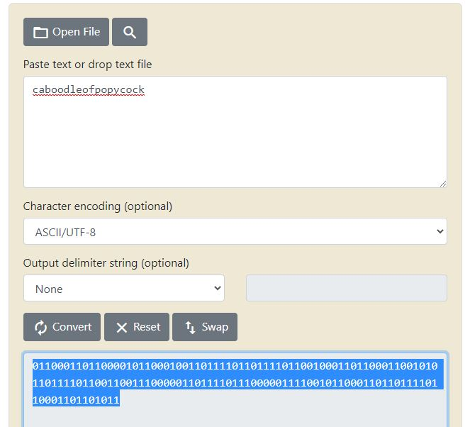

# Easter Eggs!
---
## .pog
`.pog` - This gives the author a dm stating that they found an easter egg!:

## .mystery
`.mystery` - This gives the author a dm stating that they found an easter egg!:

## devpass
The DevPass item in the shop accessed by the `.shop` command is but an easteregg hidden in plain sight...
The easteregg is that the price of it is first redonculus and second in binary reads:

`caboodleofpopycock` standing for a conglomeration of nonsesnse... *toofar??I'lltakemychances*
